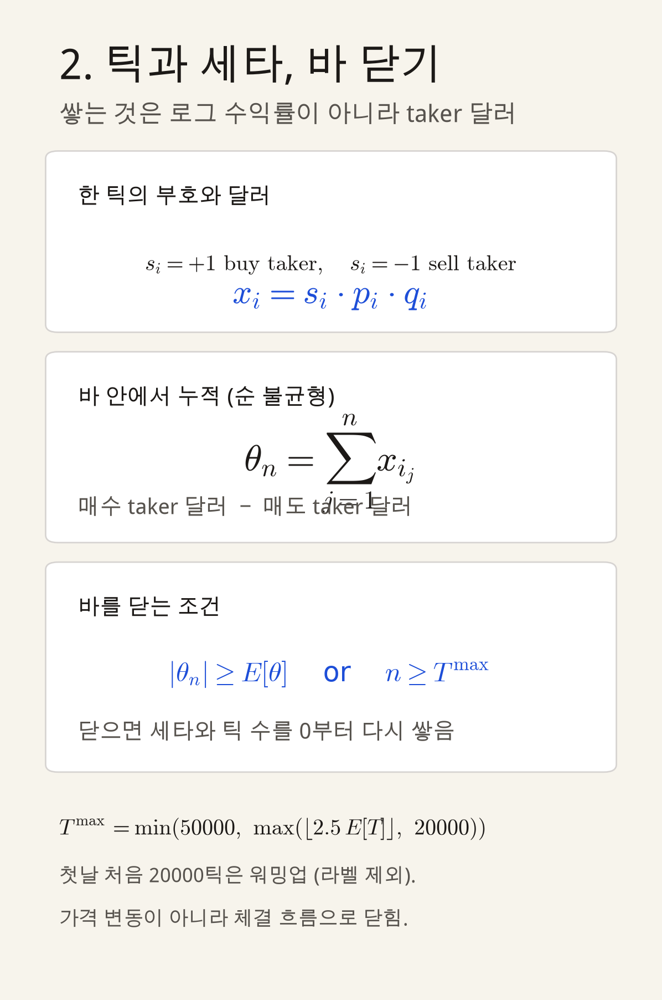
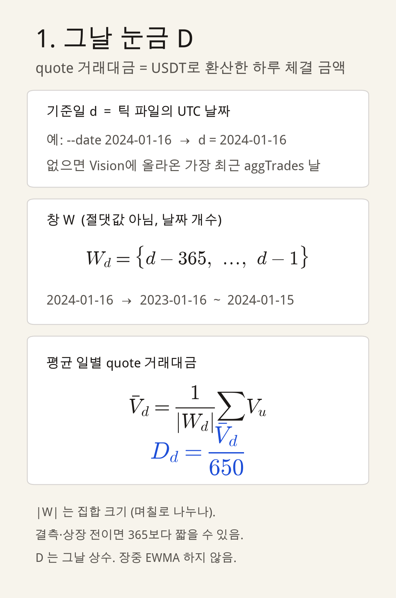
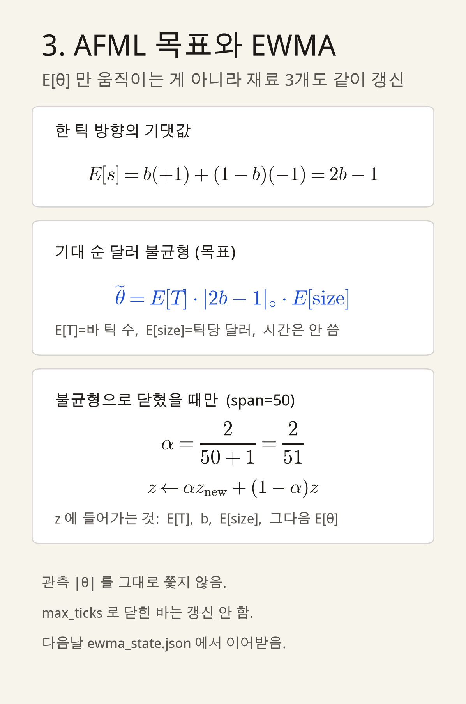
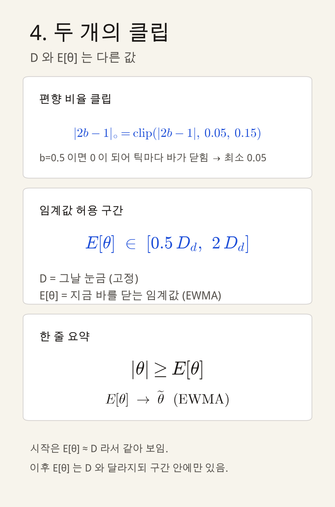
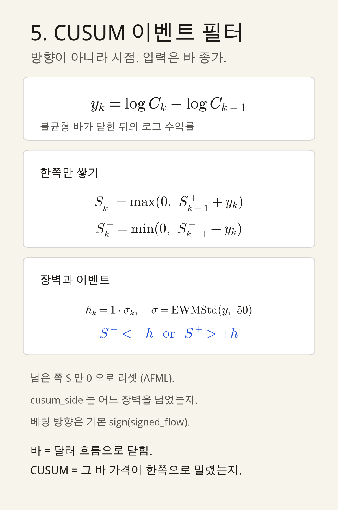

# 파이프라인 설계 메모

모바일 대화에서 잠근 내용을 Cursor에서 다시 보기 위한 정리입니다.
구현 브랜치: `cursor/binance-imbalance-cusum-6121`

수식이 잘리면 아래 카드 이미지를 보면 됩니다.

- [1. 그날 눈금 D](formula-cards/01-D-window.png)
- [2. 틱, 세타, 바 닫기](formula-cards/02-theta-close.png)
- [3. AFML과 EWMA](formula-cards/03-afml-ewma.png)
- [4. 클립과 D vs E[θ]](formula-cards/04-clips.png)
- [5. CUSUM](formula-cards/05-cusum.png)

---

## 층

| 층 | 하는 일 | 현재 |
| --- | --- | --- |
| 달러 불균형 바 | 샘플 시계 | 구현됨 |
| CUSUM | 언제 볼지 | 구현됨 |
| 1차 | 어느 쪽인지 | `sign(signed_flow)` |
| 세컨더리(메타) | 그 베팅을 받을지 | `y_meta` 라벨까지. 학습기는 아직 없음 |
| CPCV | IS 안 학습/검증 | 분할만 구현 |

볼린저 돌파 1차는 쓰지 않습니다. `sign(θ)`가 바를 만든 식과 같고 recall이 더 납니다.

---

## 1. 틱과 달러 불균형 바

`BTCUSDT` aggTrades. `qty`는 코인 수량, 달러는 `price * qty` (quote).

Taker 부호:

- `is_buyer_maker = false` → 매수 taker → \(s = +1\)
- `is_buyer_maker = true` → 매도 taker → \(s = -1\)

\[
x_i = s_i \cdot p_i \cdot q_i, \qquad
\theta_n = \sum_{j=1}^{n} x_{i_j}
\]

\(\theta\)는 그 바의 매수 taker 달러 − 매도 taker 달러입니다.

닫는 조건:

\[
|\theta_n| \ge E[\theta]
\quad \text{또는} \quad
n \ge T^{\max}
\]

\[
T^{\max} = \min\bigl(50000,\ \max(\lfloor 2.5\,E[T]\rfloor,\ 20000)\bigr)
\]

닫으면 \(\theta\)와 틱 수를 0부터 다시 쌓습니다. 가격이 아니라 체결 흐름으로 닫습니다.
첫날 처음 20000틱은 워밍업(라벨 제외). `max_ticks`로 닫힌 바는 EWMA를 갱신하지 않습니다.

---

## 2. 그날 눈금 \(D\)

기준일 \(d\)는 틱 파일의 UTC 날짜입니다. `--date 2024-01-16`이면 \(d\)가 그날이고, 없으면 Vision 최신 aggTrades 날입니다.

\(d-365\)는 연도에서 365를 빼는 게 아니라, `timedelta`로 **달력 365일 전**입니다. 윤년·28/30/31일을 반영합니다. 파이썬 `datetime` 그레고리력 산술이고, 외부 달력을 받아오지 않습니다.

예: \(d=\) 2024-01-16 → 창은 2023-01-16 ~ 2024-01-15.

\[
W_d = \{d-365,\ \ldots,\ d-1\}
\]

\(|W_d|\)는 절댓값이 아니라 **날짜 개수**입니다. 결측·상장 전이면 365보다 짧을 수 있습니다.

\(V_u\)는 그날 quote 거래대금(USDT 합)입니다.

\[
\bar V_d = \frac{1}{|W_d|}\sum V_u, \qquad
D_d = \frac{\bar V_d}{650}
\]

\(D_d\)는 그날 상수입니다. 장중 EWMA하지 않습니다.

---

## 3. \(E[\theta]\)와 EWMA

\(E[\theta]\)는 **지금 바를 닫는 임계값**입니다. 시작은 \(D_d\)에 가깝고, 이후 변합니다. \(D\)와 같은 값이 아닙니다.

한 틱 방향의 기댓값:

\[
E[s] = b(+1) + (1-b)(-1) = 2b-1
\]

AFML 목표 (바 길이는 초가 아니라 틱 수 \(E[T]\)):

\[
\widetilde\theta = E[T]\cdot |2b-1|_{\circ}\cdot E[\mathrm{size}]
\]

\[
|2b-1|_{\circ} = \mathrm{clip}(|2b-1|,\ 0.05,\ 0.15)
\]

\(b=0.5\)면 \(|2b-1|=0\)이라 틱마다 바가 닫히므로 하한 0.05를 둡니다.

불균형으로 닫혔을 때만 (`span=50`):

\[
\alpha = \frac{2}{51}, \qquad
z \leftarrow \alpha z_{\mathrm{new}} + (1-\alpha)z
\]

갱신 대상: \(E[T]\), \(b\), \(E[\mathrm{size}]\), 그다음 \(E[\theta]\) (목표 \(\widetilde\theta\) 쪽으로).
관측 \(|\theta|\)를 그대로 쫓지 않습니다. 다음날은 `ewma_state.json`에서 이어받습니다.

허용 구간:

\[
E[\theta] \in [0.5\,D_d,\ 2\,D_d]
\]

---

## 4. CUSUM (이벤트 시각)

방향이 아니라 시점입니다. 입력은 닫힌 불균형 바 종가입니다.

\[
y_k = \log C_k - \log C_{k-1}
\]

\[
S^+_k = \max(0,\ S^+_{k-1}+y_k), \qquad
S^-_k = \min(0,\ S^-_{k-1}+y_k)
\]

\[
h_k = 1\cdot \sigma_k, \qquad
\sigma = \mathrm{EWMStd}(y,\ \mathrm{span}=50)
\]

\(S^- < -h\) 또는 \(S^+ > +h\)이면 이벤트. 넘은 쪽만 0으로 리셋합니다.
`cusum_side`는 어느 장벽을 넘었는지이고, 베팅 방향이 아닙니다.

불균형 바와 다릅니다. 바는 달러 흐름, CUSUM은 가격 경로입니다.

---

## 5. 1차: `sign(signed_flow)`

\[
\mathrm{side} = \mathrm{sign}(\theta)
\]

CUSUM이 고른 그 바의 taker 달러 순흐름 부호입니다. \(\theta>0\) 롱, \(\theta<0\) 숏, \(0\)이면 버립니다.

AFML이 이 식을 지정하지는 않았습니다. AFML은 층(시점 → 방향 → 메타)만 고정하고, 1차는 단순 규칙이어도 된다고 합니다. 같은 \(\theta\)를 방향에 쓰는 것은 타깃 누수는 아니고, 시계와 1차가 정보를 공유하는 중복입니다. 메타가 미래 장벽으로 채점하므로 구조는 허용됩니다.

CUSUM 부호를 1차로 쓰면 “언제”와 “어느 쪽”이 같은 교차가 됩니다. 지금은 이벤트(가격)와 1차(흐름)를 나눠 두었습니다.

---

## 6. 세컨더리(메타)

모델이 아니라 **라벨까지**입니다. 방향은 1차가 정했고, 이 층은 그 베팅을 받을지만 봅니다.

진입은 이벤트 바 종가. 장벽은 바 로그 수익률 EWM \(\sigma\) (span 50).

\[
\mathrm{PT} = C(1+\mathrm{side}\cdot 1\sigma), \quad
\mathrm{SL} = C(1-\mathrm{side}\cdot 1\sigma), \quad
\tau = 20\text{바}
\]

경로는 이후 바 high/low. 먼저 닿은 쪽.

| 터치 | `y_meta` |
| --- | --- |
| 익절 먼저 | 1 |
| 손절 먼저 | 0 |
| 동시 | 0 |
| 타임아웃 | 0 |

손절에 −1을 주지 않습니다. 세컨더리는 방향을 뒤집는 게 아니라 **받을지/말지**입니다. `{−1,0,+1}`은 1차 없이 방향을 학습할 때의 라벨입니다.

`meta_model = "random_forest"`는 이름만 있습니다. 트리 개수, 깊이, 피처는 아직 없습니다.

---

## 7. IS / OOS / CPCV

- **IS:** 2024-01-01 ~ 2025-12-31. 여기서만 CPCV.
- **OOS:** 2026-01-01 ~ 2026-08-13. 학습·검증에 안 씀.

IS를 한 번만 자르지 않습니다. 라벨을 시간 순 5덩어리로 나누고, 2개를 검증·3개를 학습으로 쓰는 조합(10갈래)입니다. 뒤섞지 않습니다. 라벨 구간이 겹치면 purge, 검증 뒤에는 embargo. 길이는 일단 \(\tau=20\)바입니다.

---

## 아직 아닌 것

- 전 구간 하이퍼파라미터 검증 (650, \(h=1\sigma\), 클립, span 50)
- 랜덤 포레스트 학습 (피처, `n_estimators`, `max_depth`)
- 2017부터 aggTrades 아카이브 수집은 다른 브랜치에서 진행 중
